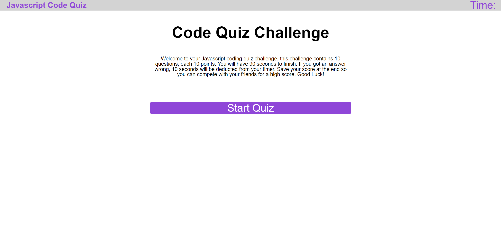
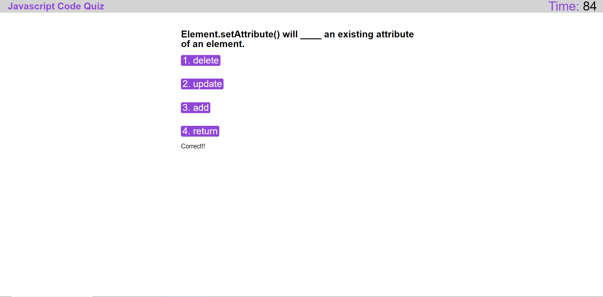
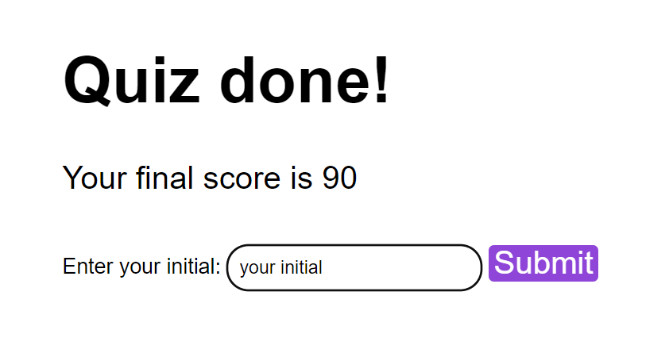
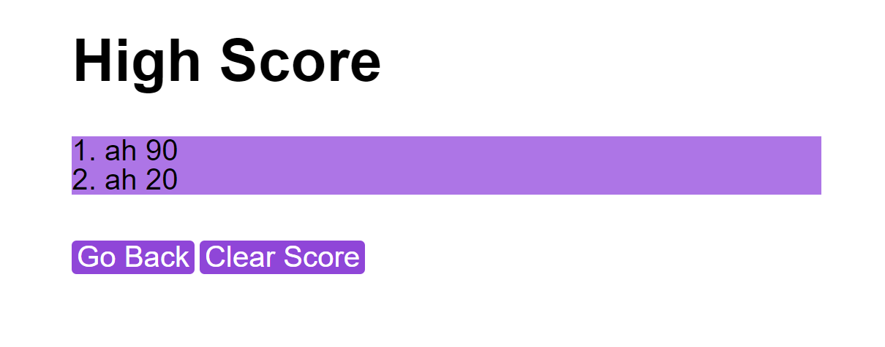

# Coding Quiz Challenge

- [Description](#description)
- [Visualization and Usage](#visualization-and-usage)
- [Contribution](#contribution)
- [License](#license)

## Description

**This is an web application for Javascript coding quiz. It contains 10 basic questions that will test your knowledge on Javascript syntax and Web APIs.**

**The coding quiz is developed with Javascript, HTML and css**

## Visualization and Usage

> Application Starting Page

> Click `Start Quiz` to start the quiz

> On the quiz page timer will be on the top-right corner

> Make your choice to get to the next question
>
> A indicator will appear below the choices to tell your if your answer is right or wrong

> After you finish all your questions, your score will show and you can input your initial to save your score

> You can see all your past scores on the High Score page, compete with your self and your friends!

> Don't like your scores? Clear it with the `Clear Score` button.

## Contribution

Pull requests are welcome. For major changes, please open an issue first to discuss what you would like to change.

## License

MIT License 

Copyright (c) 2022 hmhtom

Permission is hereby granted, free of charge, to any person obtaining a copy
of this software and associated documentation files (the "Software"), to deal
in the Software without restriction, including without limitation the rights
to use, copy, modify, merge, publish, distribute, sublicense, and/or sell
copies of the Software, and to permit persons to whom the Software is
furnished to do so, subject to the following conditions:

The above copyright notice and this permission notice shall be included in all
copies or substantial portions of the Software.

THE SOFTWARE IS PROVIDED "AS IS", WITHOUT WARRANTY OF ANY KIND, EXPRESS OR
IMPLIED, INCLUDING BUT NOT LIMITED TO THE WARRANTIES OF MERCHANTABILITY,
FITNESS FOR A PARTICULAR PURPOSE AND NONINFRINGEMENT. IN NO EVENT SHALL THE
AUTHORS OR COPYRIGHT HOLDERS BE LIABLE FOR ANY CLAIM, DAMAGES OR OTHER
LIABILITY, WHETHER IN AN ACTION OF CONTRACT, TORT OR OTHERWISE, ARISING FROM,
OUT OF OR IN CONNECTION WITH THE SOFTWARE OR THE USE OR OTHER DEALINGS IN THE
SOFTWARE.
